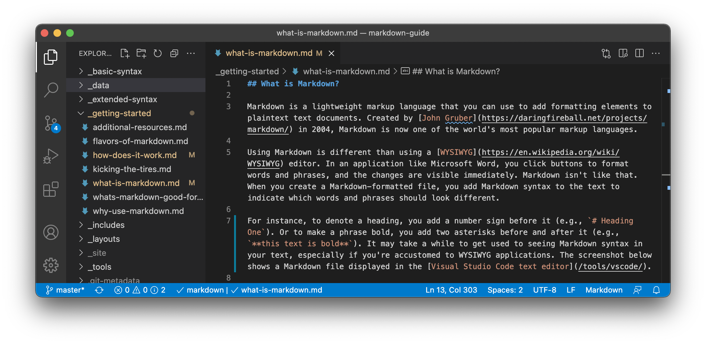
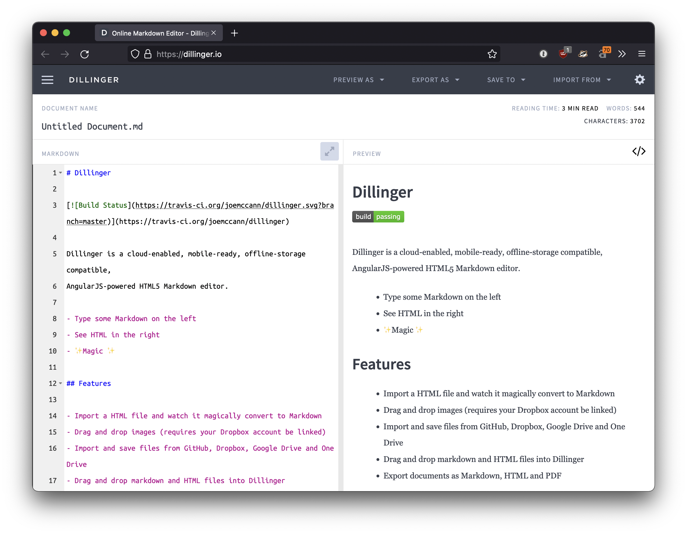

# Getting Started with Markdown

> Original Link: [Markdown Beginner's Guide | Chinese Version](https://www.markdown.xyz/getting-started/)

_A comprehensive introduction to Markdown, its workings, and its uses._

<!--TOC-->

## What is Markdown?

Markdown is a lightweight markup language that allows you to add formatted elements to plain text documents. Created by [John Gruber](https://daringfireball.net/projects/markdown/) in 2004, Markdown has become one of the most popular markup languages worldwide.

Using Markdown is different from using WYSIWYG editors like Microsoft Word. In applications such as Microsoft Word, you click buttons to format words and phrases, and changes are immediately visible. In contrast, with Markdown, you indicate how words and phrases should appear by inserting Markdown syntax into your text.

For example, to create a heading, you simply add a hash symbol in front of a phrase (e.g., `# Heading One`). To bold a phrase, you enclose it with double asterisks (e.g., `**this text is bold**`). It may take some time to get used to seeing Markdown syntax in your text, especially if you are accustomed to WYSIWYG applications. The screenshot below shows how Markdown files appear in [VSCode](https://code.visualstudio.com/).

You can use a text editor to add Markdown-formatted elements to plain text files. Alternatively, you can install Markdown applications for macOS, Windows, Linux, iOS, and Android. Some web-based applications are also available for Markdown writing.

Depending on the application you use, you may not have real-time preview of formatted documents. However, that's okay. According to [Gruber](https://daringfireball.net/projects/markdown/), Markdown syntax is designed to be readable and unobtrusive, so Markdown files are easy to read even without rendering.

> The primary design goal of Markdown syntax is readability. Based on this goal, Markdown-formatted documents can be published as-is in plain text, without looking like they've been marked up with tags or formatting instructions.

## Why Use Markdown?

You might wonder why people use Markdown instead of WYSIWYG editors. When you can format text by pressing buttons in an interface, why bother with Markdown for writing? It turns out there are two main reasons people use Markdown over WYSIWYG editors:

- Markdown is everywhere. People use it to create [websites](#websites), [documents](#documents), [notes](#notes), [books](#books), [presentations](#presentations), [emails](#email), and [technical documentation](#documentation).

- Markdown is portable. Almost any application can open text files formatted in Markdown. If you decide you don't like the Markdown application you're using, you can import your Markdown files into another Markdown application. This stands in stark contrast to word processing applications like Microsoft Word, which lock your content into proprietary file formats.

- Markdown is platform-independent. You can create Markdown-formatted text on any device running any operating system.

- Markdown adapts to future changes. Even if the application you're using becomes unusable at some point, you can still read Markdown-formatted text with a text editor. This is an important consideration when dealing with books, university papers, and other milestone documents that need to be preserved indefinitely.

- Markdown is ubiquitous. Websites like [Reddit](/tools/reddit/) and GitHub support Markdown, as do many desktop and web-based applications.

## Tools of the Trade

The best way to get started with Markdown is to use it often. Thanks to the availability of many free tools, getting started with Markdown is easier than ever before.

You don't even need to download any programs to start writing in Markdown; there are several online Markdown editors available. [MDEditor](https://www.zybuluo.com/mdeditor) is one of the best online Markdown editors. You can start writing in the left pane on their site. The rendered document appears in the right pane.

As you read this guide, you can open the MDEditor website. This way, you can practice Markdown syntax while learning. Once familiar with Markdown, you can install Markdown-supporting applications on your desktop or mobile device.

## How Markdown Works

MDEditor makes writing Markdown easy by hiding what happens behind the scenes, but the overall process is worth exploring.

When you write in Markdown format, your text content is stored in plain text files with a `.md` or `.markdown` extension. What happens next? How does your Markdown-formatted file get converted into an HTML or printable document?

Simply put, you need a *Markdown application* that can process Markdown files. There are many applications to choose from, ranging from simple scripts to desktop applications like Microsoft Word. Despite looking different visually, all applications perform the same operation. Like MDEditor, they convert Markdown-formatted text into HTML for display in a web browser.

Markdown applications use something called a *Markdown processor* (also often referred to as a "parser" or "implementation") to output Markdown-formatted text into HTML format. At this point, you can view your document in a web browser or combine it with stylesheets for printing. You can see an intuitive representation of this process in the image below.

Note: Markdown applications and processors are two separate components. For simplicity, I've combined them into one element ("Markdown application") in the image below.

In summary, it's a four-step process:

1. Use a text editor or Markdown-specific application to create Markdown files. These files should have a `.md` or `.markdown` extension.
2. Open the Markdown file in a Markdown application.
3. Use the Markdown application to convert the Markdown file into an HTML document.
4. View the HTML file in a web browser or use the Markdown application to convert it into another file format, such as PDF.

Depending on the application you use, this process will vary. For example, MDEditor essentially combines steps 1-3 into a single, seamless interface where you type content in the left pane and the converted result magically appears in the right pane. However, if you're using other tools (like a text editor with a static site generator), you'll find the process more apparent.

## What Markdown is Used For

Markdown is a quick and easy way to take notes, create content for websites, and generate printable documents.

Learning Markdown syntax doesn't take long, and once you know how to use it, you can write in Markdown almost anywhere. Most people use Markdown to create content for websites, but Markdown is also excellent for formatting everything from emails to shopping lists.

Here are some scenarios where you might use Markdown.

### Websites

Markdown was designed for the web, so it's no surprise there are many applications designed specifically for creating website content with Markdown files.

For the easiest way to use Markdown files to create a website, consider two sites called [blot.im](https://blot.im) and [smallvictori.es](https://smallvictori.es). Once you register with one of these services, they create a Dropbox folder on your computer. Just drag and drop your Markdown files into that folder, and whoosh, those files are on your website. It's that easy.

If you're familiar with HTML, CSS, and version control tools, try [Jekyll](/tools/jekyll/), a popular static site generator that builds Markdown files into HTML websites. One of the advantages of this method is that [GitHub Pages](/tools/github-pages/) offers free hosting for websites generated by Jekyll. If Jekyll isn't your ideal choice, you can choose from many other static site generators available on the [staticgen.com](https://www.staticgen.com/) website.

Note: This *Markdown Guide* is created using Jekyll. You can view its source code on GitHub.

If you prefer to use a content management system (CMS) to support your website, try [Ghost](/tools/ghost/). It's a free, open-source blogging platform with an excellent Markdown editor. If you're a WordPress user, you'll be pleased to know that websites hosted on WordPress.com [support Markdown](https://en.support.wordpress.com/markdown/). Self-hosted WordPress sites can enable Markdown support using the [Jetpack plugin](https://jetpack.com/support/markdown/).

### Document Materials

Markdown lacks all the features of a word processing program like Microsoft Word, but it's more than adequate for creating basic documents like assignments and letters. You can use Markdown document creation tools to create Markdown-formatted documents and export them as PDF or HTML formats. PDF formats are key because once you have a PDF document, you can do anything with it: print it, send it via email, or upload it to a website.

Here are some Markdown document creation tools I recommend:

Platform | Tool | Link
---|---|---
Mac | MacDown | https://macdown.uranusjr.com/
Mac | Marked | https://marked2app.com/
Mac / iOS / Android | iA Writer | https://ia.net/writer
Windows | ghostwriter | https://wereturtle.github.io/ghostwriter/
Windows | Markdown Monster | https://markdownmonster.west-wind.com/
Linux | ReText | https://github.com/retext-project/retext
Linux | ghostwriter | https://wereturtle.github.io/ghostwriter/
Web | MDEditor | https://www.zybul